# AiRi

Language: English | [中文简体](https://github.com/xieyezi/flutter-shopping-ArRi)


### have been migrate to null-safety version

Supported features：

- [x]  Complete e-commerce shopping process
- [x]  Animation linkage between category pages
- [x]  Use provider (version 4.x) for state management
- [x]  Network request encapsulation based on dio (version 3.x)
- [x]  Processing and packaging of input boxes and other components
- [x]  Pull down to refresh + pull up to load more
- [x]  Custom Dialog


Realize specific design effects by setting, modifying, combining self-contained parts and customizing to meet the needs of daily development.

This project is still in continuous iteration, just give 🌟🌟 if you like it !

## Operating environment

```
Flutter 2.2.0 • channel stable • https://github.com/flutter/flutter.git
Framework • revision b22742018b (10 days ago) • 2021-05-14 19:12:57 -0700
Engine • revision a9d88a4d18
Tools • Dart 2.13.0
```


## Next Plan

- [x]  Organize project folders and optimize code
- [x]  Complete the login page
- [ ]  Complete product multi-spec selection function
- [ ]  Support night mode

## Feedback and Suggestions

If you have a better idea or you want to participate in this project ,Welcome to PR!

## Preview

The effect of some pages is as follows:

| 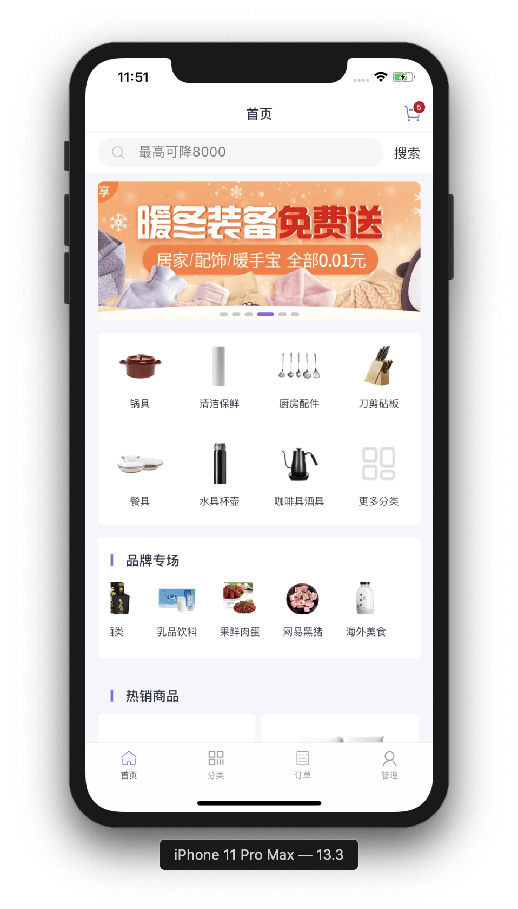  |   |   | 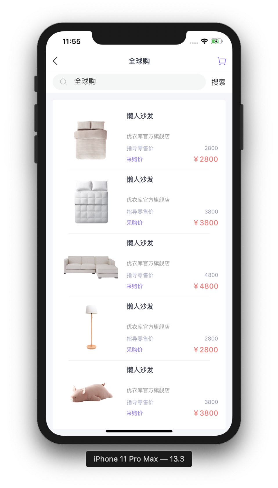  |
| :---------------------------------: | :---------------------------------: | :---------------------------------: | :---------------------------------: |
| 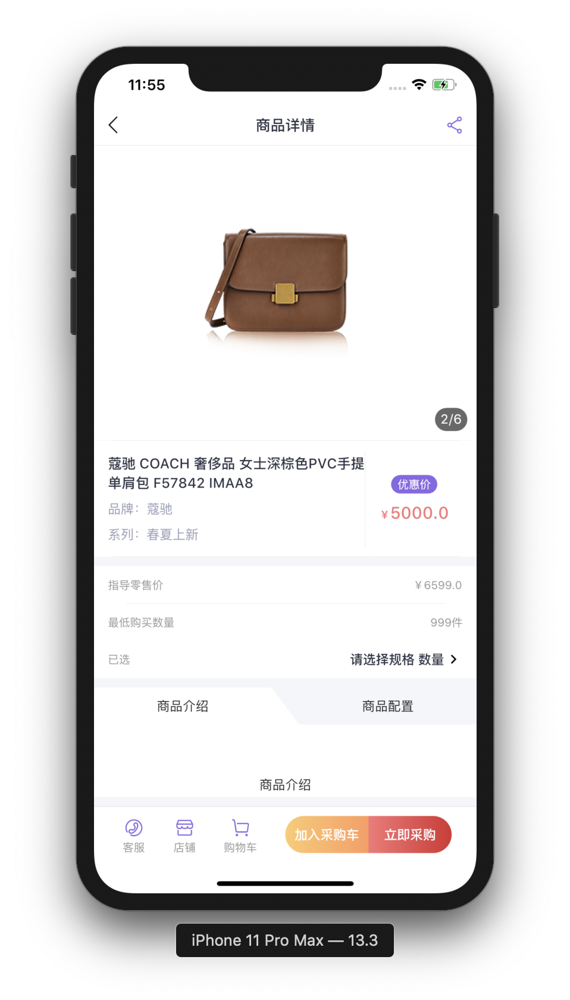  | 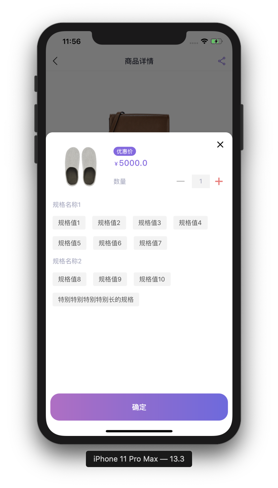  |   | 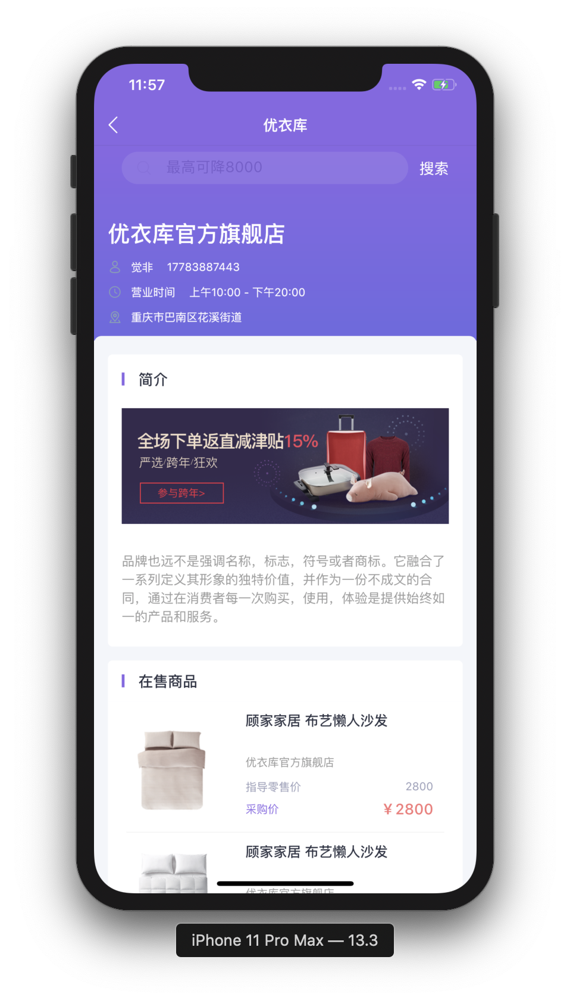  |
| 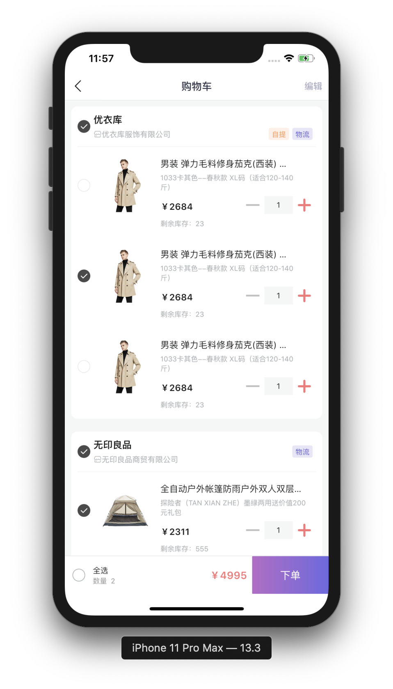  | 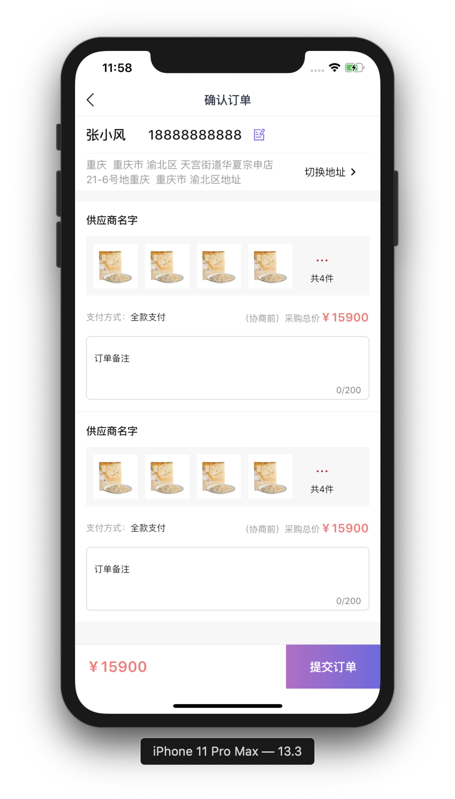 | 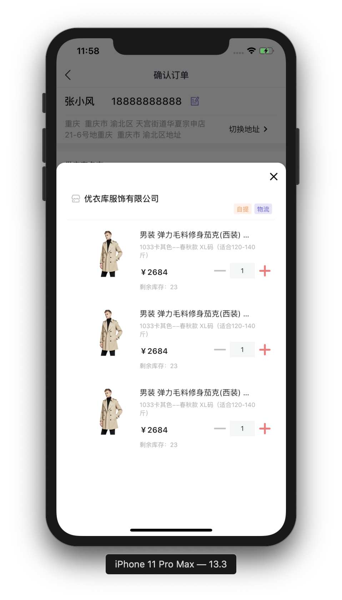 |  |
| 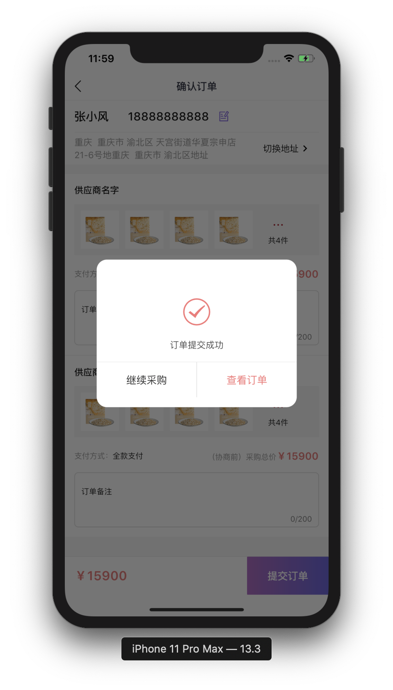 | 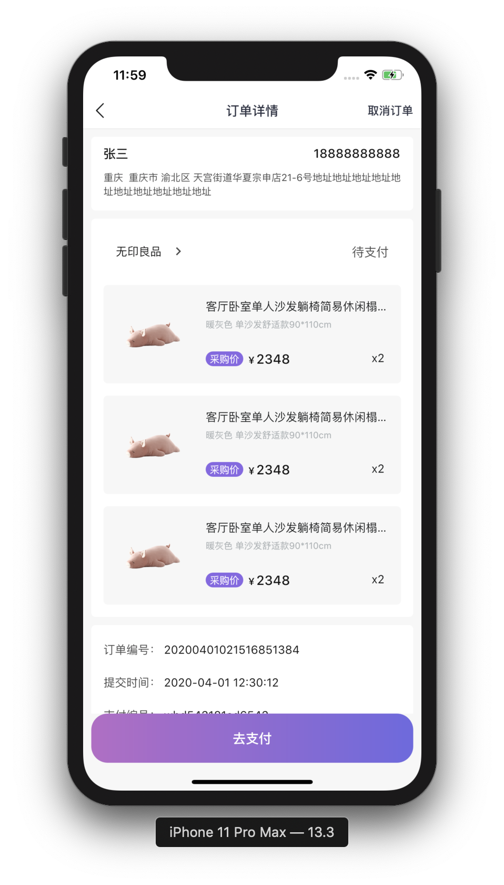 | 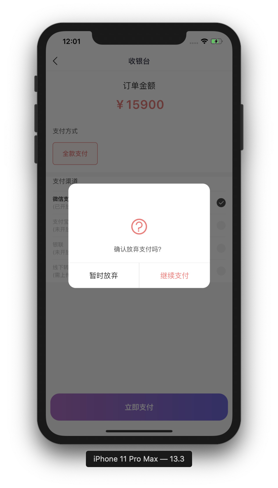 |  |
| 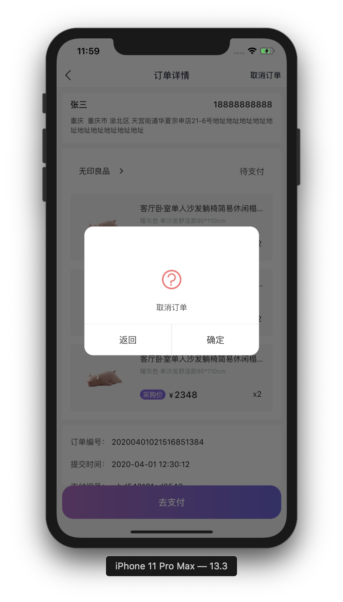 | 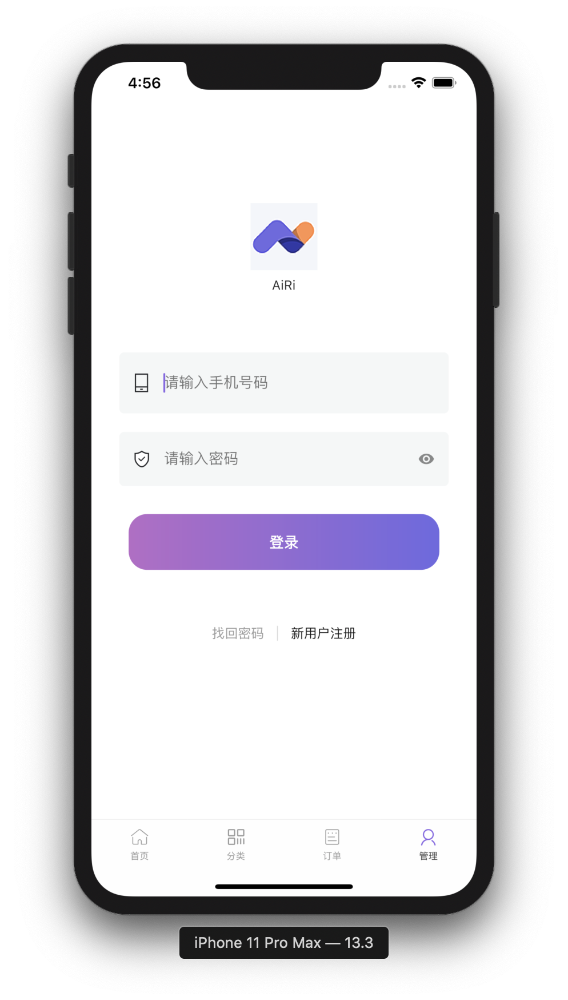 | 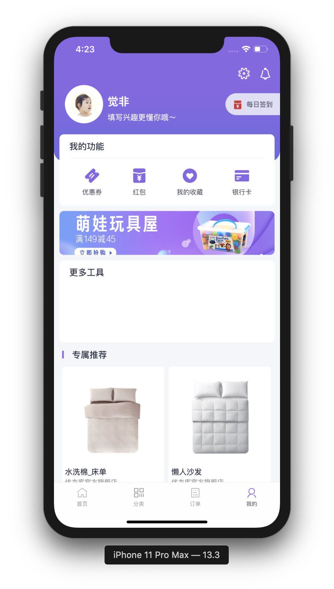 |  |
|  |  |  |  |
|  |  |                                     |                                     |
